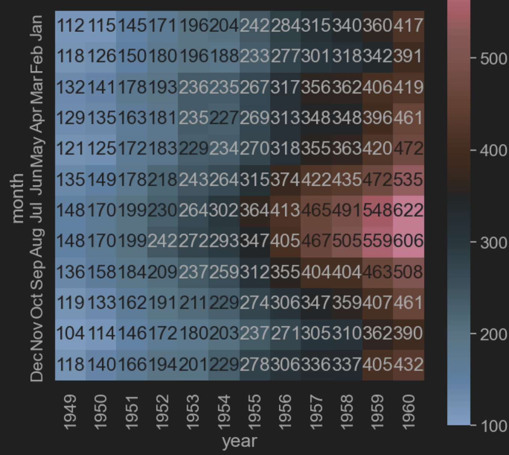
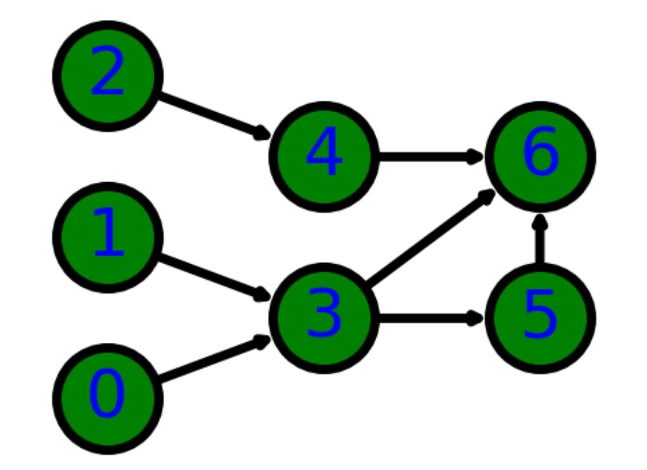
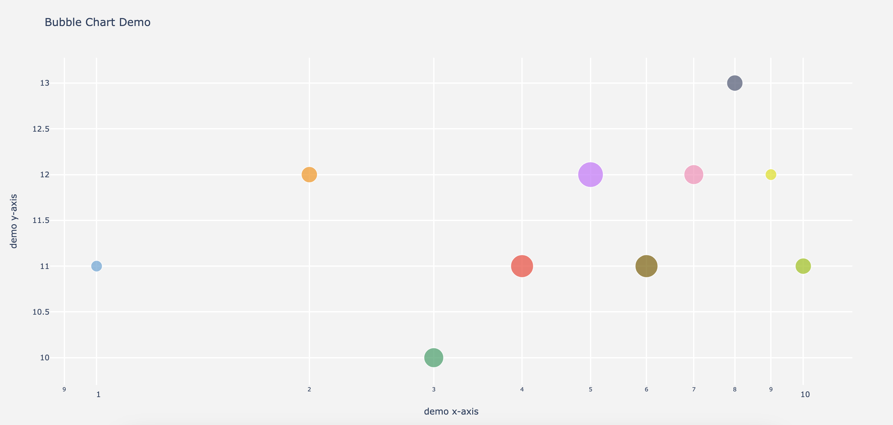

# Visualization
- All in Python.
- Containing: [Heatmap](#heatmap), Bubble, Net Graph, etc.

## Heatmap {#heatmap}
> Reference: [Heatmap](https://zhuanlan.zhihu.com/p/96040773)

- ==FIXME==: Use pandas to uniform the format. [ref](https://anl.sjtu.edu.cn/mcm/docs/name/%E5%9F%BA%E7%A1%80%E7%83%AD%E5%8A%9B%E5%9B%BE)

- `code/heatmap.ipynb` 

## Network Planning
- [Online Version](https://echarts.apache.org/examples/zh/editor.html?c=graph-simple&lang=js)
- `code/network.py` 

## Basic Bubble Chart
> Reference: [Bubble Chart 1](https://python-graph-gallery.com/bubble-plot/) [Bubble Chart 2](https://plotly.com/python/bubble-charts/) [Bubble Chart 3](https://www.geeksforgeeks.org/bubble-chart-using-plotly-in-python/)

- `code/bubble.py` 

## Scatter Plot
> Reference: [Scatter Plot](https://python-graph-gallery.com/web-scatterplot-text-annotation-and-regression-matplotlib/)

